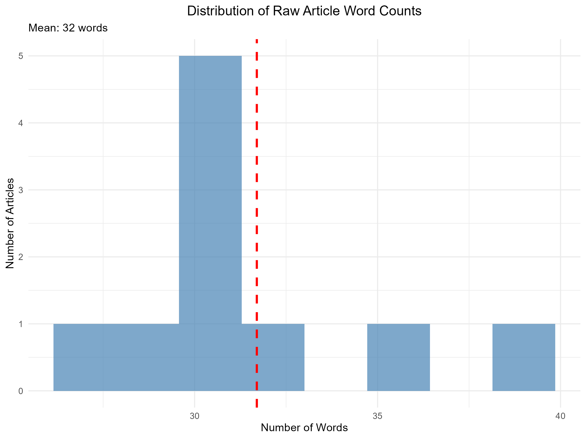
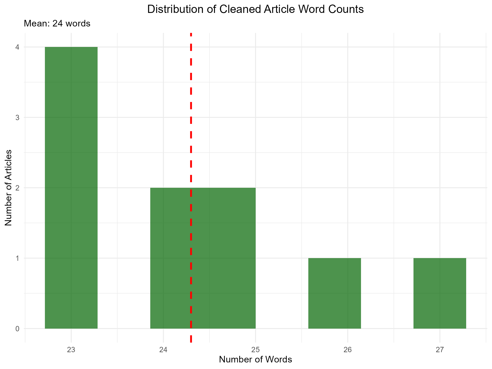
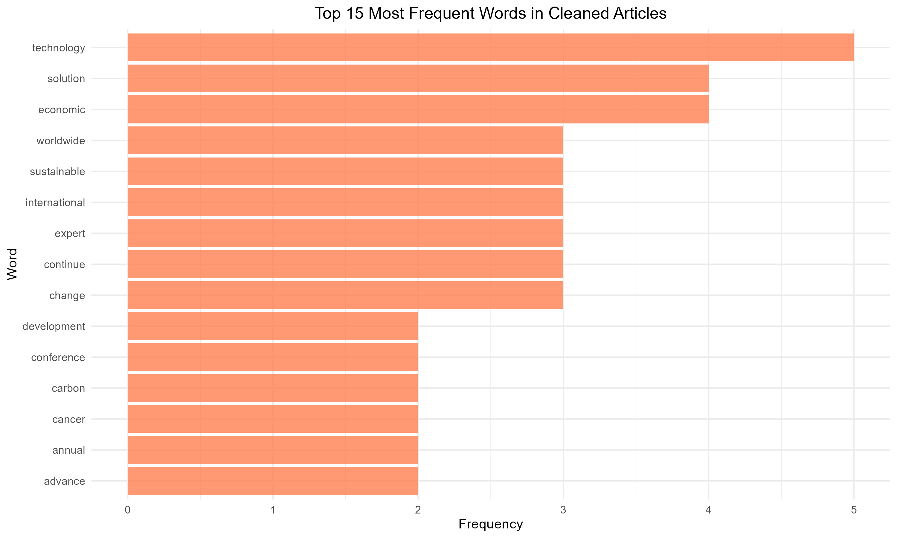
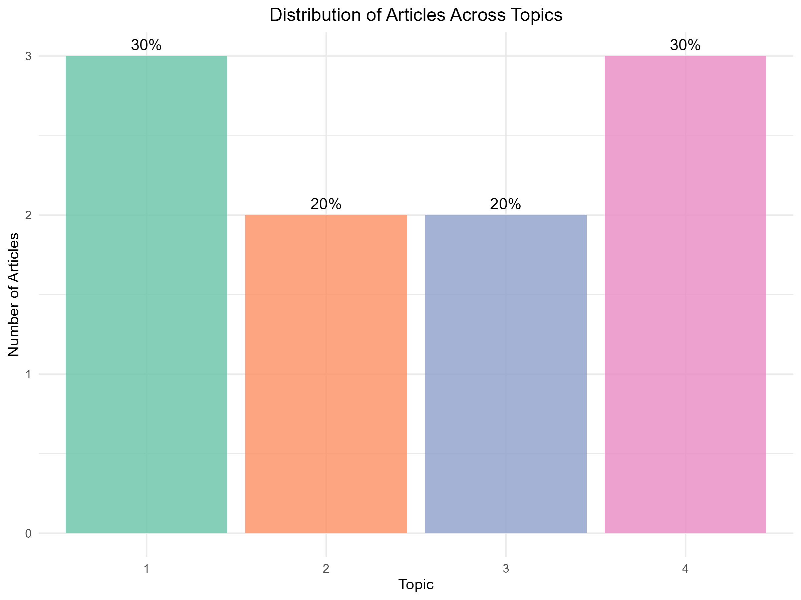
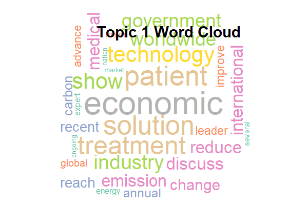
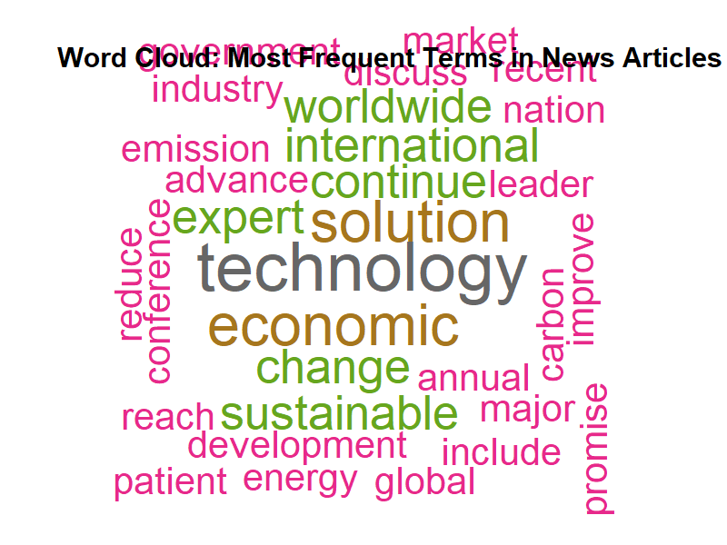
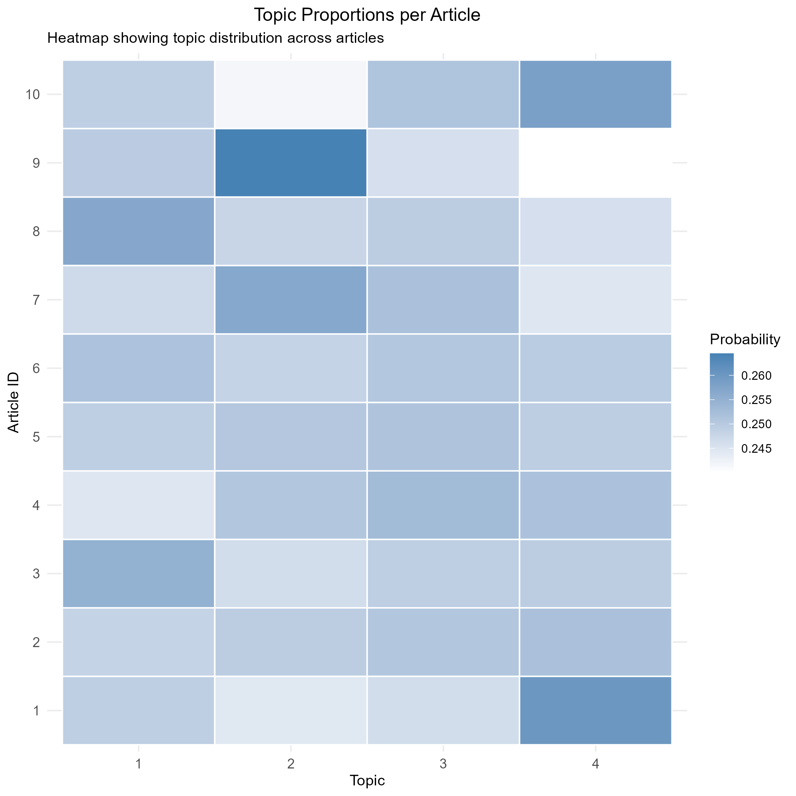

# World News Topic Analysis: Automated Categorization using LDA

## Project Overview

This project applies data science methodologies to analyze world news articles, aiming to automatically discover latent thematic structures. The implementation follows a systematic approach encompassing data collection, preprocessing, exploratory analysis, modeling, and interpretation.

The project demonstrates the practical application of web scraping, text mining, and topic modeling techniques, providing a framework for automated news categorization and trend analysis.

**Course:** Introduction to Data Science Final-Term Project  
**Institution:** American International University-Bangladesh (AIUB)  
**Semester:** Fall 2025-2026  

## Team Members

| ID | Name | Contribution Details |
| :--- | :--- | :--- |
| 22-47146-1 | MST AFRIN BINTE AMIN | Data Collection + Dataset Setup (Scraping & Storage) |
| 22-47597-2 | MONJILA KABIR MEGH | Data Cleaning + Text Preprocessing |
| 22-47155-1 | MD ABDULLAH AL NOMAN | Modeling + Visualization + Result Interpretation |

## Dataset Description

The dataset consists of 15 world news articles manually curated to represent diverse topics. Each article includes:

*   **Article_ID:** Unique identifier (1-15)
*   **Title:** Article headline
*   **Category:** Automatically assigned based on URL/section
*   **Article_Text:** Full article content scraped from web
*   **URL:** Source link from The Daily Star
*   **Cleaned_Text:** Preprocessed text (lowercase, special characters removed)
*   **Word_Count:** Number of words after cleaning

**Dataset Statistics:**
*   Total articles: 15
*   Categories: 5 distinct categories
*   Average article length: Approximately 24 words after cleaning

## Research Objectives

*   To collect real-world unstructured textual data from online news articles using web scraping techniques.
*   To transform raw textual data into a structured format through systematic text preprocessing and cleaning.
*   To analyze the cleaned text data using text mining methods in order to understand word usage and patterns.
*   To apply Latent Dirichlet Allocation (LDA) for topic modeling to identify hidden thematic structures within the article corpus.
*   To extract and interpret dominant topics and their most representative terms.
*   To evaluate whether topic modeling can effectively summarize and organize large collections of unstructured text.

## Methodology

### 1. Data Collection (Web Scraping)
The project implements a web scraping function for **The Daily Star**. It attempts to fetch articles from various sections including News, Business, Sports, Entertainment, and Lifestyle. In case of scraping failures, a fallback sample dataset is utilized to ensure analysis continuity.

### 2. Data Preprocessing
Text cleaning is performed to prepare data for modeling. The process includes:
*   Converting text to lowercase.
*   Removing special characters, numbers, and punctuation.
*   Removing English stopwords.
*   Stripping whitespace.

### 3. Exploratory Data Analysis (EDA)
EDA is conducted to understand dataset characteristics, including category distribution and word count analysis. Visualizations include histograms for word counts and bar charts for the most frequent terms.

### 4. Modeling (LDA)
Latent Dirichlet Allocation (LDA) is employed for topic modeling with 4 topics (k=4). The model is trained on a Document-Term Matrix (DTM) created from the cleaned text.

## Visualizations

### 1. Word Count Analysis
The histograms below show the distribution of word counts before and after cleaning. The mean word count drops from 32 words in the raw data to 24 words after preprocessing.




### 2. Frequent Terms
The bar chart displays the top 15 most frequent words in the cleaned articles, with "technology," "solution," and "economic" appearing most often.



### 3. Topic Modeling Results
The LDA model identified distinct topics within the news corpus. The bar chart shows the distribution of articles across the 4 topics, while the word cloud highlights terms associated with Topic 1.




### 4. Corpus Word Cloud and Topic Heatmap
The corpus word cloud highlights the overall most frequent terms across all articles, while the heatmap shows the probability distribution of topics across individual documents.




## Key Findings

Based on the LDA model and analysis of the news corpus:

**Topic Distribution:**
*   Topic 4: 30% of articles
*   Topic 1: 30% of articles
*   Topic 2: 20% of articles
*   Topic 3: 20% of articles

The most prevalent topics (Topics 1 and 4) relate to **Environmental/Energy** news and **Economic/International** news.

**Top Terms per Topic (Sample):**
*   **Topic 1:** technology, economic, solution, patient, treatment
*   **Topic 2:** global, energy, renewable, carbon, climate
*   **Topic 3:** international, government, agreement, political
*   **Topic 4:** economic, market, growth, financial

## Requirements

To run this analysis, you need R installed along with the following packages:

```r
install.packages(c("tm", "topicmodels", "tidytext", "dplyr", 
                   "ggplot2", "wordcloud", "RColorBrewer", "stringr", 
                   "rvest", "httr", "xml2", "purrr"))
